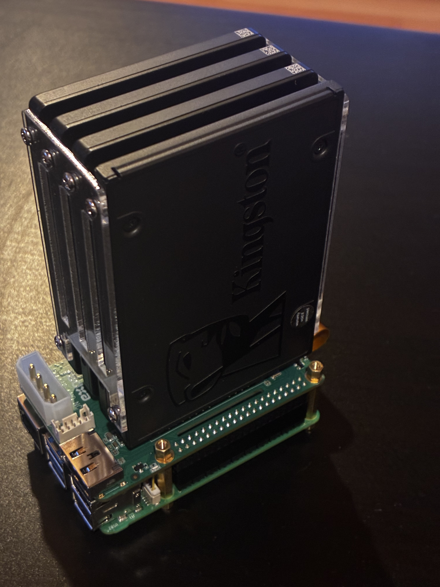
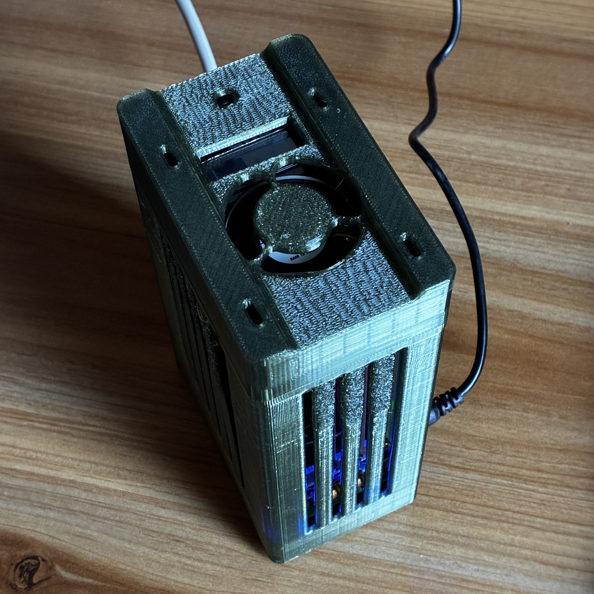

# Raspberry Pi 5 NAS



Turn a Raspberry Pi 5 and a Radxa Penta SATA HAT into a capable home NAS — running OpenMediaVault, Nextcloud, Immich, Home Assistant, and more, all in Docker.

## 📋 Project Overview

This project documents the complete process of building a low-power, always-on home NAS using a Raspberry Pi 5 and the Radxa Penta SATA HAT. It covers hardware assembly, OpenMediaVault installation, storage pooling with mergerfs and SnapRAID parity, and deploying self-hosted services via Docker.

### Key Features

- 🖥️ **Headless Operation** - Managed entirely via SSH and web interfaces
- 💾 **5-Drive SATA Expansion** - Radxa Penta SATA HAT adds 5× 2.5" SATA ports via PCIe
- 📁 **Samba Sharing** - Native Mac Finder / Windows Explorer integration
- ☁️ **Nextcloud** - Self-hosted personal cloud storage
- 📷 **Immich** - Self-hosted Google Photos replacement
- 🏠 **Home Assistant** - Smart home hub running on the same box
- 🔐 **Tailscale** - Zero-config VPN for secure remote access without port forwarding
- 🛡️ **SnapRAID Parity** - Protects against single drive failure
- ⚡ **Low Power** - ~10–15W typical, suitable for 24/7 operation

## 🖼️ Gallery

| NAS Build | Assembled Stack |
|-----------|----------------|
|  |  |

## 🔧 Hardware

### Required Parts

| Part | Notes |
|------|-------|
| **Raspberry Pi 5 (8GB or 16GB)** | 16GB recommended for multiple Docker containers |
| **Raspberry Pi 5 Active Cooler** | Official cooler — important for sustained load |
| **Radxa Penta SATA HAT** | Adds 5× 2.5" SATA ports via PCIe |
| **Radxa Penta SATA HAT Top Board** | Required — provides GPIO connection and fan header |
| **GPIO extension cable (40-pin)** | Required to resolve Active Cooler conflict — see [Assembly Guide](docs/01-HARDWARE-ASSEMBLY.md) |
| **2–5× NAS-grade 2.5" SATA SSD** | WD Red SA500, Seagate IronWolf 125, or Samsung 870 EVO |
| **12V 5A+ barrel jack PSU (5.5×2.5mm)** | Powers HAT, SSDs, and Pi via GPIO — 6A recommended |
| **MicroSD card (32GB+, A2 rated)** | OS only — SanDisk Extreme or Samsung EVO Select |
| **Cat6 Ethernet cable** | Wired connection strongly recommended over WiFi |

### Optional but Recommended

| Part | Notes |
|------|-------|
| 80mm PWM fan (4-pin, 5V or 12V) | Mounts on Top Board fan header — improves SSD cooling |
| USB-C power supply (27W / 5A) | Additional Pi power if HAT supply is insufficient |
| Case with ventilation | 3D printable designs available |

## ✨ What You Get

### Access Methods

1. **SSH** — Command-line access from any device
   ```bash
   ssh <user>@pi5-nas.local
   ```

2. **OpenMediaVault** — Web dashboard for storage and services
   ```
   http://pi5-nas.local
   ```

3. **Portainer** — Docker container management
   ```
   http://pi5-nas.local:9000
   ```

4. **Nextcloud** — Personal cloud (files, contacts, calendar)
   ```
   http://pi5-nas.local:8080
   ```

5. **Immich** — Photo and video library
   ```
   http://pi5-nas.local:2283
   ```

6. **Home Assistant** — Smart home automation
   ```
   http://pi5-nas.local:8123
   ```

7. **Samba** — Native file sharing
   - Mac: connect to `smb://pi5-nas.local` — appears in Finder sidebar
   - Windows: map `\\pi5-nas.local\` as a network drive

8. **Tailscale** — Access all of the above securely from anywhere

## 🚀 Quick Start

### Prerequisites

- Raspberry Pi 5 (8GB or 16GB)
- Radxa Penta SATA HAT + Top Board
- 40-pin GPIO extension cable
- 2–5 NAS-grade 2.5" SATA SSDs
- 12V 5A+ barrel jack power supply
- MicroSD card (32GB+, A2)
- Ethernet connection during setup
- ~3–4 hours of time

### Setup Steps

1. **[Assemble hardware](docs/01-HARDWARE-ASSEMBLY.md)** — Pi + Active Cooler + GPIO extension + Penta HAT
2. **[Install OpenMediaVault](docs/02-OPENMEDIAVAULT.md)** — Flash Pi OS, install OMV and OMV-Extras
3. **[Configure storage](docs/03-STORAGE.md)** — mergerfs pool + SnapRAID parity
4. **[Set up Docker & Portainer](docs/04-DOCKER.md)** — Container platform
5. **[Deploy Nextcloud](docs/05-NEXTCLOUD.md)** — Personal cloud
6. **[Deploy Immich](docs/06-IMMICH.md)** — Photo library
7. **[Deploy Home Assistant](docs/07-HOME-ASSISTANT.md)** — Smart home hub
8. **[Configure Tailscale](docs/08-TAILSCALE.md)** — Secure remote access
9. **[Set up backups](docs/09-BACKUPS.md)** — SnapRAID sync + Vault rsync

## ⚠️ Pi 5 Gotcha — Ethernet Interface Name

> The Raspberry Pi 5 Ethernet interface is named **`end0`**, not `eth0`.

If OMV is configured with `eth0` and runs a salt deploy or network reconfiguration, it will regenerate the network config using `eth0` — a non-existent interface on the Pi 5 — and the Pi will become completely unreachable. Recovery: SSH in, restore the OMV config backup, and run `sudo omv-salt deploy run network`.

## 📚 Documentation

| Guide | Description |
|-------|-------------|
| [01 — Hardware Assembly](docs/01-HARDWARE-ASSEMBLY.md) | Parts, GPIO conflict fix, step-by-step build |
| [02 — OpenMediaVault](docs/02-OPENMEDIAVAULT.md) | OS flash, OMV install, SMART monitoring |
| [03 — Storage](docs/03-STORAGE.md) | mergerfs pool, SnapRAID parity setup |
| [04 — Docker & Portainer](docs/04-DOCKER.md) | Container platform setup |
| [05 — Nextcloud](docs/05-NEXTCLOUD.md) | Self-hosted cloud storage |
| [06 — Immich](docs/06-IMMICH.md) | Self-hosted photo library |
| [07 — Home Assistant](docs/07-HOME-ASSISTANT.md) | Smart home hub |
| [08 — Tailscale](docs/08-TAILSCALE.md) | Secure remote access via VPN |
| [09 — Backups](docs/09-BACKUPS.md) | Backup strategy, Vault rsync, off-site |

## 🛠️ Software Stack

| Component | Purpose |
|-----------|---------|
| **Raspberry Pi OS Lite (64-bit)** | Base operating system |
| **OpenMediaVault 7** | NAS management platform |
| **mergerfs** | Combines multiple drives into one pool |
| **SnapRAID** | Parity-based drive failure protection |
| **Docker** | Container runtime for all services |
| **Portainer** | Docker web UI |
| **Nextcloud** | Self-hosted cloud storage |
| **Immich** | Photo and video management |
| **Home Assistant** | Smart home automation |
| **Tailscale** | Zero-config WireGuard VPN |
| **Samba** | SMB file sharing |

## ⚙️ Features Implemented

- ✅ Hardware assembled with GPIO extension to resolve cooler conflict
- ✅ OpenMediaVault installed and configured
- ✅ SnapRAID parity + nightly sync
- ✅ mergerfs storage pool
- ✅ Docker moved off SD card to secondary SSD
- ✅ Nextcloud (personal cloud)
- ✅ Immich (photo library)
- ✅ Home Assistant (smart home)
- ✅ Samba sharing (Mac + Windows)
- ✅ Tailscale remote access
- ✅ SMART drive monitoring
- ✅ Automated Vault backup (nightly rsync)
- ✅ Email notifications via OMV

## 📊 Performance Expectations

| Metric | Value |
|--------|-------|
| **Boot time** | ~90 seconds (power-on to fully accessible) |
| **Power draw** | ~10–15W typical |
| **LAN transfer speed** | ~100–115 MB/s (Gigabit Ethernet) |
| **Concurrent services** | All services run simultaneously on 16GB model |
| **Best for** | Home NAS, personal cloud, photo library, smart home hub |

## 🎯 Use Cases

Perfect for:
- Home network-attached storage
- Self-hosted Nextcloud (replacing Google Drive / iCloud)
- Self-hosted photo library (replacing Google Photos)
- Smart home hub (replacing cloud-dependent hubs)
- Learning Linux server and Docker administration
- Low-power 24/7 home server

## 🔐 Security Considerations

- Change OMV admin password immediately after first login
- Change Pi OS user password during initial setup
- Use SSH key authentication — disable password auth after keys are working
- Enable HTTPS on OMV and services if exposing beyond your local network
- Keep the system updated: `sudo apt update && sudo apt upgrade`
- Use Tailscale for remote access — avoid exposing ports directly to the internet

## 🌍 Remote Access

Tailscale is the recommended approach — no ports exposed, no dynamic DNS, works through NAT:

1. Install Tailscale on the Pi (see [Tailscale guide](docs/08-TAILSCALE.md))
2. Install Tailscale on your phone/laptop
3. Access all services via the Pi's Tailscale IP (e.g., `100.x.x.x`) from anywhere

See [08 — Tailscale](docs/08-TAILSCALE.md) for full setup.

## 📁 Repository Structure

```
.
├── README.md                        # This file
├── docs/
│   ├── 01-HARDWARE-ASSEMBLY.md     # Parts list, GPIO fix, assembly steps
│   ├── 02-OPENMEDIAVAULT.md        # OMV install and configuration
│   ├── 03-STORAGE.md               # mergerfs + SnapRAID setup
│   ├── 04-DOCKER.md                # Docker and Portainer
│   ├── 05-NEXTCLOUD.md             # Nextcloud deployment
│   ├── 06-IMMICH.md                # Immich deployment
│   ├── 07-HOME-ASSISTANT.md        # Home Assistant deployment
│   ├── 08-TAILSCALE.md             # Tailscale VPN setup
│   └── 09-BACKUPS.md               # Backup strategy and scripts
├── scripts/
│   ├── backup-vault.sh             # Nightly critical file rsync
│   ├── drive-health.sh             # Drive SMART health check
│   └── snapraid-sync.sh            # SnapRAID sync automation
├── configs/
│   ├── smb.conf.example            # Samba share config
│   └── snapraid.conf.example       # SnapRAID config
├── images/                          # Build photos
├── CONTRIBUTING.md
└── LICENSE
```

## 🤝 Contributing

Contributions are welcome! See [CONTRIBUTING.md](CONTRIBUTING.md) for guidelines.

**Ways to contribute:**
- Report hardware compatibility with other SATA HATs or Pi accessories
- Submit documentation improvements or corrections
- Share troubleshooting solutions
- Add Docker compose examples for additional services

## 📝 License

This project documentation is released under the [MIT License](LICENSE). Free to use, modify, and share.

## 🙏 Acknowledgments

- Radxa for the Penta SATA HAT and its open documentation
- OpenMediaVault community for excellent Raspberry Pi support
- Immich, Nextcloud, and Home Assistant communities for their outstanding open-source work
- Everyone building self-hosted alternatives to cloud services

## 📧 Contact

**Author:** Shameek Vats  
**Project Type:** Open source build guide  
**Status:** Operational and documented

---

⭐ **Found this helpful?** Star the repo and share it with others building their own home NAS!

## 🔗 Useful Resources

- [Radxa Penta SATA HAT Documentation](https://wiki.radxa.com/Penta_SATA_HAT)
- [OpenMediaVault Documentation](https://docs.openmediavault.org/)
- [Immich Documentation](https://immich.app/docs)
- [Nextcloud Documentation](https://docs.nextcloud.com/)
- [Home Assistant Documentation](https://www.home-assistant.io/docs/)
- [Tailscale Documentation](https://tailscale.com/kb/)

---

**Last Updated:** June 2026
